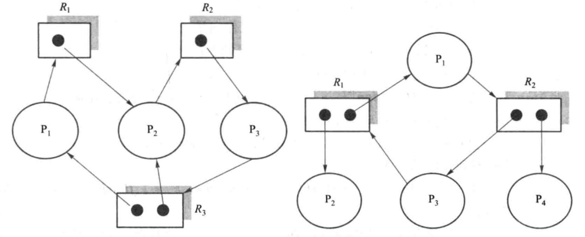

# lec 20 死锁与IPC spoc 思考题

- 有"spoc"标记的题是要求拿清华学分的同学在实体课上完成的，对于学堂在线的选课同学是可选题目。

## 视频相关思考题

### 20.1 死锁概念 

1. 什么是死锁？

 > 死锁：多个进程在执行过程出现无限期循环等待的情况

2. 尝试举一个生活中死锁实例。

 > 双向可行驶的单车道道路

3. 可重用资源和消耗资源有什么区别？

 > 可重用和不可撤销；

4. 资源分配图中的顶点和有向边代表什么含义？

 > 顶点代表进程和资源

 > 有向边代表资源的请求关系（进程P请求资源R）和分配关系（资源R分配给了进程P）

5. 出现死锁的4个必要条件是什么？

 > 互斥

 > 持有并等待

 > 非抢占

 > 循环等待

### 20.2 死锁处理方法

1. 死锁处理的方法有哪几种？它们的区别在什么地方？

 > 死锁预防：确保不会出现死锁条件同时出现的情况；

 > 死锁避免：使用前进行判断，只允许不会出现死锁的资源请求；

 > 死锁检测和恢复：发现死锁后，进行恢复；

2. 安全序列的定义是什么？

 > 进程的最大资源需要量小于当前可用资源与序列中前面进程占用资源的总和；

3. 安全、不安全和死锁有什么区别和联系？

 > 安全时，不会出现死锁；

 > 不安全表示可能出现死锁，但不是一定出现死锁；

### 20.3 银行家算法 

1. 什么是银行家算法？

 > 依据客户申请贷款的最大资金量，银行在每笔贷款前判断贷款后系统是否处于安全状态

2. 安全状态判断和安全序列是一回事吗？

 > 是一回事。存在安全序列表示处于安全状态。

### 20.4 死锁检测

1. 死锁检测与安全状态判断有什么区别和联系？

 > 死锁检测是在资源分配后判断是否存在死锁；没有进程最大资源请求量的要求；

 > 安全状态判断是资源分配前依据进程最大资源请求量判断是否存在安全序列；

 > 死锁检测、安全状态判断和安全序列判断的本质就是资源分配图中的循环等待判断。

### 20.5 进程通信概念

1. 直接通信和间接通信的区别是什么？

 > 本质上来说，直接通信可以理解为两个直接通信，间接通信中假定有一个永远有效的直接通信方。

2. 同步和异步通信有什么区别？

 > 同步通信：通信收方和发方都会等待收发成功后才返回；

 > 异步通信：通信收方和发方在完成数据发送或已有数据接收后立即返回，不会等待收发成功信息；

### 20.6 信号和管道 

1. 什么是信号（signal）？

 > 进程间的软件中断通知和处理机制。

2. 信号通信有什么特点？

 > 类似于中断，信号通信速度快；信息量小，只有一个信号类型值；

3. 什么是管道？

 > 管道是进程间基于内存文件的通信机制。

4. 写一个检查本机网络服务工作状态并自动重启相关服务的程序。

### 20.7 消息队列和共享内存

1. 什么是消息队列？

 > 由操作系统维护的以字节序列为基本单位的间接通信机制。

2. (spoc) 用C语言在Linux系统下写测试用例，测试管道、消息队列和共享内存三种通信机制进行不同通信间隔和通信量情况下的通信带宽、通信延时、带宽抖动和延时抖动方面的性能差异。

 > 参考测试用例：在内存中开指定大小数组，生成随机数据写入数组（最后两个字节为16位的校验和），然后创建指定类型的通信信道并发送和接收数据，收到数据后要利用校验和检测数据正确性；数据收发过程重复指定的次数，并计时；最后通过分析计时数据得到通信带宽、通信延时、带宽抖动和延时抖动等性能数据。

 > [管道的例子](https://github.com/chyyuu/ucore_lab/blob/master/related_info/lab7/ipc/pipe-ex2.c)

## 小组思考题

1. （spoc） 每人用python实现[银行家算法](https://github.com/chyyuu/ucore_lab/blob/master/related_info/lab7/deadlock/bankers-homework.py)。大致输出可参考[参考输出](https://github.com/chyyuu/ucore_lab/blob/master/related_info/lab7/deadlock/example-output.txt)。除了`YOUR CODE`部分需要填写代码外，在算法的具体实现上，效率也不高，可进一步改进执行效率。
2. (spoc) 以小组为单位，请思考在lab1~lab5的基础上，是否能够实现IPC机制，请写出如何实现信号，管道或共享内存（三选一）的设计方案。
3. (spoc) 扩展：用C语言实现某daemon程序，可检测某网络服务失效或崩溃，并用信号量机制通知重启网络服务。[信号机制的例子](https://github.com/chyyuu/ucore_lab/blob/master/related_info/lab7/ipc/signal-ex1.c)

## 课后练习

在Window、MacOS或Linux操作系统中用C、C++、python、GO或rust语言分别基于管道、消息队列和共享内存三种通信机制写进程通信程序，实现两进程间循环传输一个元素为4字节整数的数组传输。测试管道、消息队列和共享内存三种通信机制进行不同通信量情况下的通信带宽、通信延时、带宽抖动和延时抖动方面的性能差异。

要求如下：

1）在两个进程间循环传输一个4字节无符号整数数组，两个进程都对收到的数组中的每个元素进行加1，然后再发给对方；

2）每个测试中每个进程收发100000次（一收一发算一次）；

3）分别测试数组长度为5个、50个和500个元素时的特征。

## 问答题

### 死锁与并发错误检测

#### Q1：[基础] 为什么会出现死锁。

A:

#### Q2：[基础] 下图是否有死锁：


A:

#### Q3：[基础] 什么是死锁预防，举例并分析。
A:

#### Q4：[基础] 描述银行家算法如何判断安全性。

A:

### 进程通信

#### Q1：直接通信和间接通信的本质区别是什么？分别举一个例子。

A:

#### Q2：以下代码将如何运行？

```c
#include <stdio.h>
#include <unistd.h>
#include <string.h>
#include <errno.h>
int main()
{
    int fd[2];
    int ret = pipe(fd);
    if (ret == -1)
    {
        perror("pipe error\n");
        return 1;
    }
    pid_t id = fork();
    if (id == 0)  // child
    {
        int i = 0;
        close(fd[0]);
        char child[] = "I am child!";
        while (i < 5)
        {
            write(fd[1], child, strlen(child) + 1);
            sleep(2);
            i++;
        }
    }
    else if (id > 0)  //father
    {
        close(fd[1]);
        char msg[100];
        int j = 0;
        while (j < 5)
        {
            memset(msg,'\0',sizeof(msg));
            ssize_t s = read(fd[0], msg, sizeof(msg));
            printf("%s\n", msg);
            ++j;
        }
    }
    else  //error
    {
        perror("fork error\n");
        return 2;
    }
    return 0;
}
```

A:

#### Q3：操作系统把物理机器的硬件资源抽象出来，让用户进程运行在这些抽象的资源上。这样，用户进程可以认为自己 “独占” 一台逻辑上的计算机，而不是和其他进程共用一台机器的资源，从而可以大幅简化用户程序的编写。例如，通过页表机制，操作系统将物理地址空间抽象为逻辑（虚拟）地址空间；不同进程访问的同一个逻辑地址在物理上是不同的地址。通过文件系统机制，操作系统把磁盘抽象成一个一个的文件。通过处理器调度，CPU 被分时复用，可以认为是一个物理 CPU 变成了多个逻辑 CPU。按照这样的类比，本节课所讲的 “信号” 是对什么硬件资源的抽象？它能够帮助我们理解什么现象。你怎么看待这种想法？

A:

#### Q4：比较共享内存和管道各自的优缺点。

A:

#### Q5：Linux/Mac 下运行 ipcs 命令，这个命令是干啥的？

A:

#### Q6：比较管道和信息队列。

A: